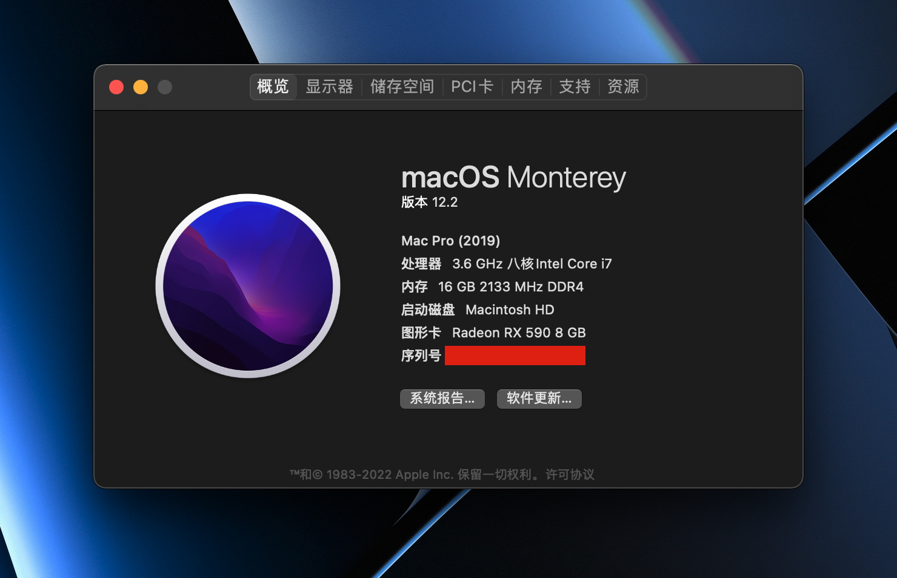

# My OpenCore Configuration

> ⚠️ WARNING:
>
> This configuration will only be suitable for my own setup. You may take it as a reference, don't use it directly.

## Screenshots

## Machine Info

* Motherboard: GIGABYTE B360M DS3H
* Processor: Intel i7 9700KF (No iGPU)
* Memory: Corsair 16GB, DDR4, 3000 MHz
* Graphics Card: AMD Radeon RX590, 8 GB
* SSD: Western Digital Black NVMe 250 GB
* HDD: Seagate 1 TB, 7200 RPM **(x2)**

## Operating System

macOS Monterey 12.2 (21D49)

## Known Issues

* Color depth is not correct for my 4K display, there are clearly visible color bands.
* Fan speed goes high sometimes when the computer wakes from sleep state.
